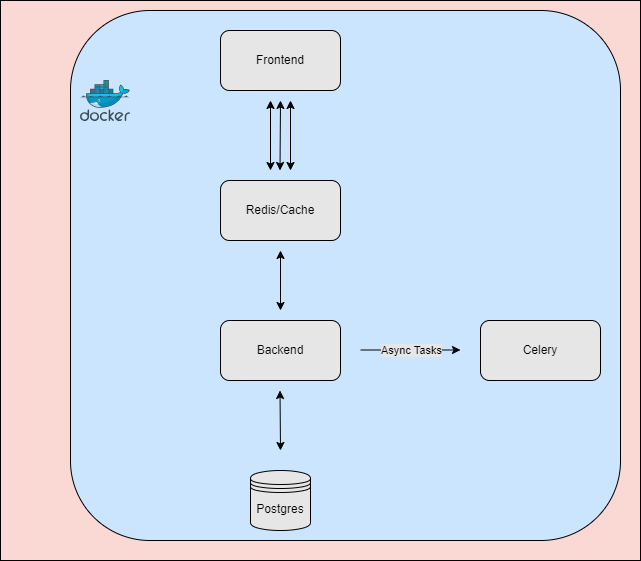

# Django, React, Redis, Celery and Postgres in Docker

Following the last project where we set up our fullstack app to use async workers, a real database and caching, we now bring that development up a level and deploy the whole stack with Docker.



- [How it works](#how-it-works)
    - [Prerequisites](#prerequisites)
    - [Docker](#docker)
    - [Repository](#repository)
- [Security](#security)
- [Resources](#resources)


# How it Works

This project is functionally identical to the last. The difference this time is the use of Docker to manage processes which run in containers. That is, we're going to define `services` where each of the components run as their own container, with their requirements isolated from the host. These processes instead use Dockers' container runtime instead.  

There is a difference in the `settings.py` file from our Django project. Notice now we use the protocol/host `redis://redis:6379` instead of `redis://localhost:6379` like last time. This is because redis has its own image and that images' service - name `redis` - is the DNS we'll resolve to. We don't need to do anything for Django and React; they'll still get exposed on localhost. 

## Prerequisites

On a mac or Windows machine, it may be easiest to install [Docker Desktop](https://www.docker.com/products/docker-desktop/). On Ubuntu, installing via snap or apt will work fine. We only need the CLI and the engine for the software. 

## Docker

First, know that there are `docker` and `docker-compose` commands. Compose is used for orchestrating many containers and the resources they use including their networks, their builds and variables among others. `docker` commands sometimes do the same thing, but I use them more for one-off commands. 

A few handy common ones:

- `docker images` to see what images are on your system
- `docker-compose up --build` does a lot of things:
    - The `--build` flag ensures the images in your compose file are built, a network is created, and the containers are set to run. Using compose here is highly recommended as you'd have to run individual commands to build and tag the images, create networks, copy files... etc if just using `docker <command> ...`  
- `docker exec -it <container-name> bash` will get you a shell in your running container
- `docker logs <container-name>` is very helpful for looking at individual logs
- `docker network inspect <network-name>` and `docker network ls` show you how the network is set up
- `docker volume` and the additional flags `prune` with `--all` will help clean up your system. During development they can take a lot of space. Same for images

<span style="color: red;">**NOTE:** </span> The react/frontend app is not correctly built here. We should really run a two-stage build where we build with a node image, and then serve with nginx or some lightweight server with some configuration (included as `./nginx.conf`). While the following excerpt does that, the styling was all missing. But know that is the correct way to do this:
```
FROM node:22-slim AS build

WORKDIR /app

COPY ./frontend/package.json ./frontend/package-lock.json ./
RUN npm install

COPY ./frontend ./
RUN npm run build

FROM nginx:alpine

COPY --from=build /app/build /usr/share/nginx/html
COPY nginx.conf /etc/nginx/nginx.conf

RUN rm /etc/nginx/conf.d/default.conf

RUN chown -R nginx:nginx /usr/share/nginx/html
RUN chown -R nginx:nginx /var/cache/nginx

EXPOSE 3000

CMD ["nginx", "-g", "daemon off;"]
```

## Repository

In order to save oneself from having to build and rebuild these images on all systems, you can store them in a Docker repository. To use this, sign up to docker. Then you can login and push both the frontend and backend images to this repo:

```
docker login -u <your-username>
docker tag frontend:latest <your-username>/math-app-frontend:latest
docker push <your-username>/math-app-frontend:latest

docker tag backend:latest <your-username>/math-app-backend:latest
docker push <your-username>/math-app-backend:latest
```

Note these are publicly available. You can make one of these private for free but after that, well that's how they get ya isn't it?

# Security
While not all security measure have been taken here, a few of the most important concepts are:
- Don't run as `root`. Note in both the backend and frontend Dockerfiles we copy files over as root, install the requirements and then have the user own those files. Highly recommended just as in Kubernetes
- Don't share the host socket with the daemon. This is something I encountered when using `make` as an abstraction over and on-top of Docker. Reading up on OWASP principles led me to [this great solution](https://integratedcode.us/2016/04/20/sharing-the-docker-unix-socket-with-unprivileged-containers-redux/) on how to achieve running multiple containers without exposing the socket

# Resources
[OWASP Security Principles for Docker](https://cheatsheetseries.owasp.org/cheatsheets/Docker_Security_Cheat_Sheet.html#rule-1-do-not-expose-the-docker-daemon-socket-even-to-the-containers)
[Docker Compose Documentation](https://docs.docker.com/compose/)